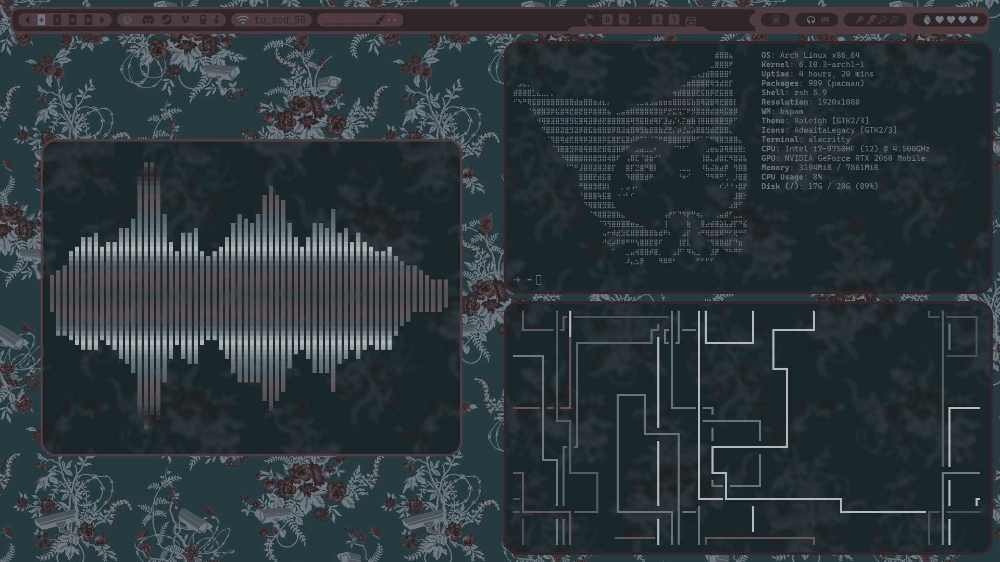
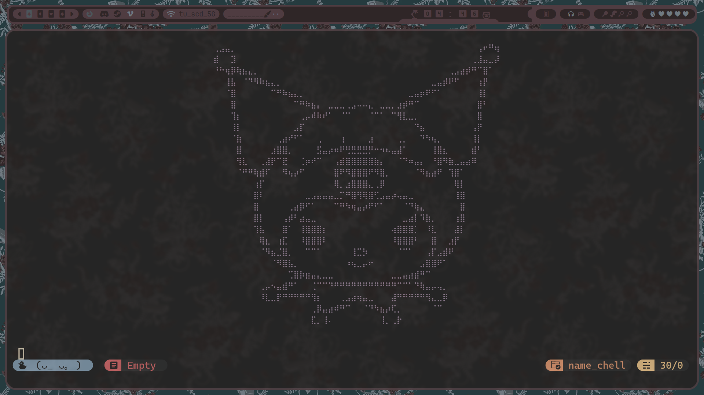
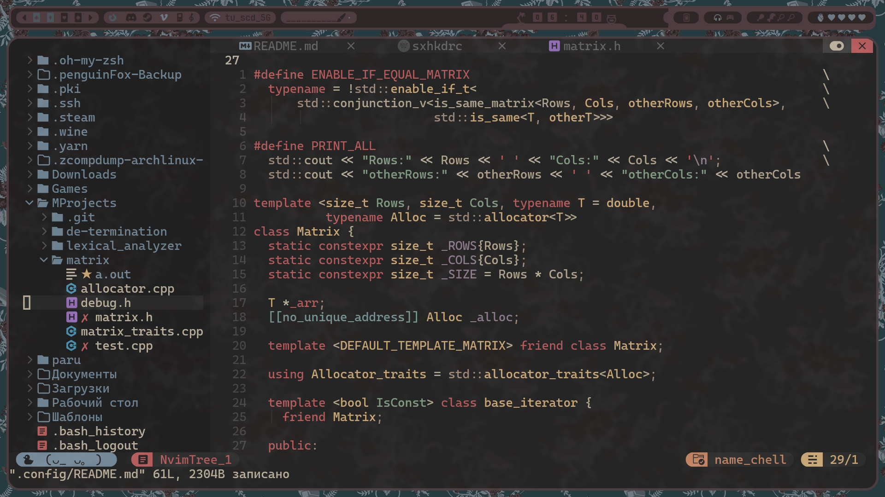
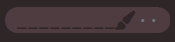
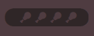
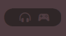
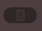

<h1 align="center"> :rose: name_Ch3ll :rose: </h1>

<!-- BADGES -->
 

  
  

<!-- INFORMATION -->
<h1 align="left"> :blue_book: About</h1> 

 

 - OS: [**`btw, i use Arch Linux`**](https://archlinux.org/)
 - IDE: [**`btw, i use nvim`**](https://neovim.io)
 - WM: [**`BSPWM`**](https://github.com/baskerville/bspwm)
 - Bar: [**`Polybar`**](https://github.com/polybar/polybar)
 - Compositor: [**`Picom`**](https://github.com/yshui/picom)
 - Terminal: [**`Alacritty`**](https://github.com/alacritty/alacritty)
 - Notify Daemon: [**`Dunst`**](https://github.com/dunst-project/dunst)
 - Shell: [**`Fish`**](https://github.com/fish-shell/fish-shell)

 

<!-- IMAGES -->
## 🖼️ Gallery

<!-- POLYBAR -->
## :rice_cracker: Modules

<h3 align="left"> volume </h3>

<h3 align="left"> RAM </h3>

<h3 align="left"> Bluetooth </h3>

<!--### volume: -->

<!--### RAM memory: -->
<!---->
<!--### Bluetooth connection and charge percentage: -->
<!---->
<!---->
<!--### Layout switching:-->
<!---->
<!---->
<!-- HOTKEYS -->
## :keyboard: HotKeys
* **Open the terminal** - `alt + enter`
* **Open the firefox** - `alt + ctrl + f`
* **Open the discord** - `alt + ctrl + d`
* **Open the steam** - `alt + ctrl + s`
* **Open the neovide** - `alt + ctrl + n`
* **Switch the layout** - `rightshift`
* **Open the browser in incognito mode** - `alt + ctrl + p`
* **Close the window that is in focus** - `alt + w`
* **Kill the window that is in focus** - `alt + shift + w`
* **Take a screenshot** - `alt_r`
* **Restart bspwm** - `alt + r`
* **Switch to another desktop** - `alt + 1-4`
* **Switch to firefox desktop** - `alt + f`
* **Switch to discord desktop** - `alt + d`
* **Switch to steam desktop** - `alt + s`
* **Switch to neovide desktop** - `alt + n`
* **Move the window to another desktop** - `alt + shift + 1-4`
* **Switch the window to tiled mode** - `alt + t`
* **Switch the window to floating mode** - `alt + s`
* **Switch the window to fullscreen mode** - `alt + f`
* **Switch the window to pseudo-tiled mode** - `alt + p`
* **Bluetooth gamepad connection** - `alt + F2`
* **Bluetooth headphones connection** - `alt + F1`
* **Bluetooth gamepad disconnection** - `alt + F3`
* **Bluetooth headphones disconnection** - `alt + F4`

The other hotkeys are in `~/.config/sxhkd/sxhkdrc`.

#
